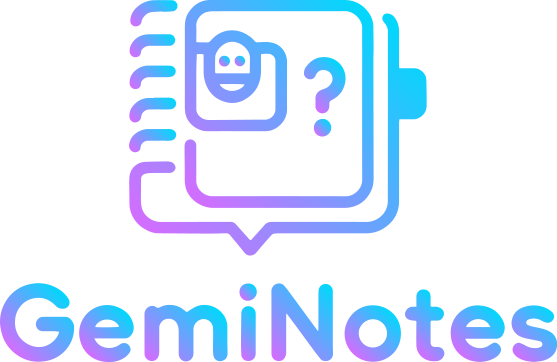
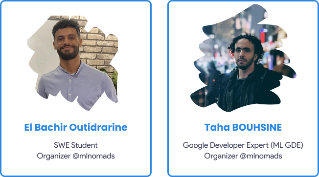

# Geminotes #AISprint

<p align="center">
  
</p>

Geminotes is a powerful note-taking and AI-powered chat system based on Google's Gemini model. The project consists of two main components: a Chrome extension for easy note-taking and a web application for note management and AI-assisted interactions.

## Demo

Check out our demo video to see Geminotes in action:

<p align="center">
  <a href="https://www.youtube.com/watch?v=kmNjNefigCE">
    
  </a>
</p>

## Project Components

1. [Chrome Extension](#chrome-extension)
2. [Web Application](#web-application)

### Chrome Extension

The Geminotes Chrome extension allows you to easily save notes and snippets from any web page.

**Features:**
- Select text on any web page and save it as a note with just a right-click
- Automatically captures the source URL
- Saves notes directly to Firebase Firestore
- Google Sign-In integration

**Repository:** [[Link to Chrome Extension Repository](https://github.com/StoicBug/Geminotes-chrome-extention)]

### Web Application

The Geminotes web app provides a comprehensive interface for managing your notes and interacting with them using AI.

**Features:**
- View and search all saved notes
- Select notes for AI-powered chat interactions
- Built with Angular and Tailwind CSS
- Retrieves notes from Firebase Firestore
- Utilizes Firebase Cloud Functions for AI chat capabilities using the Gemini model

**Repository:** [[Link to Web Application Repository]](https://github.com/StoicBug/Geminotes-web-application)

## Getting Started

To get started with Geminotes, follow these steps:

1. Clone both repositories:
   ```
   git clone https://github.com/StoicBug/Geminotes-chrome-extention
   git clone https://github.com/StoicBug/Geminotes-web-application
   ```

2. Follow the setup instructions in each repository's README for detailed installation and configuration steps.

## Technologies Used

- Google Gemini AI model
- Chrome Extension API
- Angular
- Tailwind CSS
- Firebase (Firestore, Cloud Functions, Authentication)

## The Team
<p align="center">
  
</p>

## Contributing

We welcome contributions to both the Chrome extension and web application components of Geminotes. Please refer to the individual repository README files for specific contribution guidelines.

## Acknowledgment

Google AI/ML Developer Programs team supported this work by providing Google Cloud Credit.
